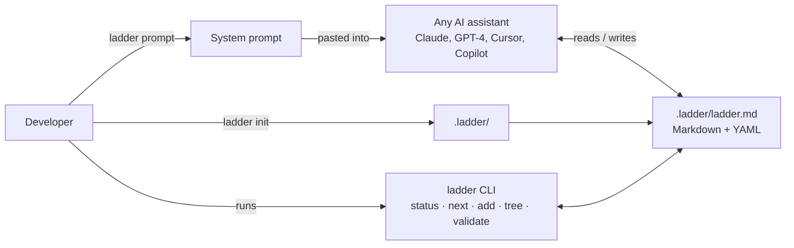

# 🪜 Ladder

[](https://pypi.org/project/ladder-cli/)
[](https://github.com/tanamsethi31/ladder/actions/workflows/ci.yml)
[](https://pypi.org/project/ladder-cli/)
[](LICENSE)
[](https://github.com/astral-sh/ruff)
[](mailto:sethit@tcd.ie)
[](https://linkedin.com/in/tanamsethi)

> Track every branch, stage, and alternative path in your AI pair-programming sessions.

When pair-programming with AI, every decision presents multiple paths. You pick one. The others vanish into scrollback. Three hours later, you realize you needed that other path too.

**Ladder captures every branch, stages them by effort, and lets you climb back to any rung.**


## Install

```bash
pip install ladder-cli
```

### Claude Code plugin (optional)

Skip the copy-paste system prompt — wire the ladder directly into Claude Code:

```bash
claude plugin marketplace add tanamsethi31/ladder
claude plugin install ladder@ladder
```

Claude sees the current ladder status automatically at session start and follows
the `ladder-tracking` skill's rules (log new options as rungs, mark choices,
show real command output) for the rest of the session — no manual `ladder prompt`
paste needed. Requires `ladder-cli` installed and on `PATH`.

## Quick Start

```bash
# 1. Initialize a ladder in your project
cd my-project
ladder init --project "My API"

# 2. Paste the system prompt into your AI assistant
ladder prompt

# 3. Start building — the AI populates the ladder automatically

# 4. Check your progress anytime
ladder status
```

## How It Works

Ladder uses a **Markdown + YAML** file (`.ladder/ladder.md`) that both you and your AI can read and write:

```markdown
---
project: My API
version: 1
---

## foundation

- [x] **R001** — Project scaffold → *small*
  - Context: Setting up the repo
  - Why: Everything builds on this

## core

- [ ] **R003** — User authentication → *medium*
  - Context: REST API auth
  - Why: Everything else depends on this
  - [x] JWT with refresh tokens
  - [ ] Session-based with Redis
  - [ ] OAuth2 social login
  - Blocked by: ~none~
```

**Why this format wins:**
- ✅ **Git-friendly** — clean diffs, full history
- ✅ **AI-friendly** — any LLM reads/writes markdown natively
- ✅ **Human-friendly** — open in any editor, understand in 30 seconds
- ✅ **CLI-friendly** — trivial to parse and render

## Architecture



No API calls, no plugin, no server — the markdown file *is* the interface between you, the CLI, and whatever AI you're using.

## Real output

This project dogfoods itself — its own `.ladder/ladder.md` tracks its own roadmap:

```
$ ladder status

🪜 ladder  v1  0 done · 0 active · 0 exploring · 3 open · 0 blocked

○ expansion
  ○ R003  HTML export  → medium
     Static HTML render of the ladder for sharing outside the terminal
  ○ R004  Better AI-formatting tolerance in the parser  → medium
     Different AI assistants drift from the exact markdown format over long sessions
  ○ R005  Stage auto-progression suggestions  → small
     Nudge which stage to focus on next based on completion state

$ ladder next

🎯 Suggested next rungs

1. R005  Stage auto-progression suggestions  → small
2. R003  HTML export  → medium
3. R004  Better AI-formatting tolerance in the parser  → medium
```

Small, well-understood work sorted ahead of bigger bets, automatically.

## Commands

| Command | Description |
|---------|-------------|
| `ladder init` | Create a new ladder in the current directory |
| `ladder status` | Show the full project ladder |
| `ladder show R003` | Detailed info for a specific rung |
| `ladder do R003` | Mark a rung as in-progress |
| `ladder complete R003` | Mark a rung as done |
| `ladder abandon R003 --reason "deprecated"` | Mark a rung as abandoned |
| `ladder tree` | Show dependencies as an ASCII tree |
| `ladder note R003 "text"` | Attach a note to a rung |
| `ladder sprint --budget 5` | Pick unblocked rungs that fit an effort budget |
| `ladder export` | Export the ladder as a static HTML file |
| `ladder prompt` | Print the system prompt for your AI |

## Why Ladder?

- **Works with any AI** — Claude, GPT-4, Cursor, Copilot, whatever
- **No lock-in** — your data is plain Markdown in your repo
- **Auto-commits** — optionally commits ladder changes to git
- **Dependency aware** — knows when a rung is blocked by another
- **Effort-weighted** — small/medium/large so you can plan sprints

## Contributing

1. Fork the repo
2. `pip install -e ".[dev]"`
3. `pytest`
4. Open a PR

## Contact

[](mailto:sethit@tcd.ie)
[](https://linkedin.com/in/tanamsethi)

Built by [Tanam Sethi](https://github.com/tanamsethi31). Questions, bug reports, or feature requests — open an [issue](https://github.com/tanamsethi31/ladder/issues) or reach out directly.

## License

MIT — see [LICENSE](LICENSE)
